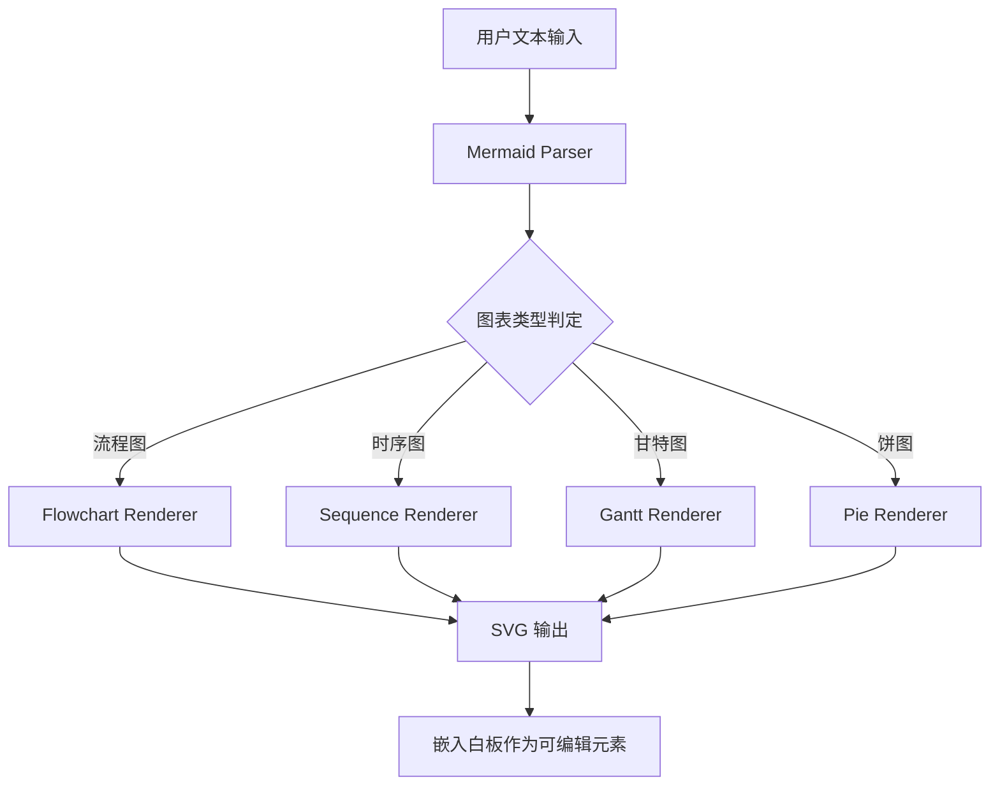

# DESIGN.md: PicDoc — AI 文本转可视化白板系统

## Source

- URL: https://www.picdoc.cn/
- Capture date: 2026-06-07
- Evidence: 第三方聚合页介绍 (aiproducthub.cn、cxgn.cn、ai.gameba.cc、新浪科技创客贴官方稿件)

## Design Summary

PicDoc 是一款 AI 驱动的「文本转视觉」在线工具，由创客贴团队孵化。其核心创新在于将 **全局可编辑白板** 与 **AI 辅助生成** 深度耦合：用户在白板上输入/粘贴文本 → 鼠标悬停/选中文字 → 弹出 AI 浮动工具栏 → 一键生成专业图表 → 结果以可编辑矢量元素回显到白板。整个过程无需切换工具，形成「编辑 → 选中 → AI 生成 → 继续编辑」的闭环工作流。

---

## 参考截图

> 网站源站 https://www.picdoc.cn/ 暂不可直接访问，以下为第三方收录的截图示意：
> - 核心交互流程：输入文本 → 选中 → 悬浮 AI 按钮 → 生成图表 → 回显白板
> - 产品评分：4.5 星
> - 支持图表类型：饼图、流程图、SWOT、甘特图、思维导图等数十种

---

## 一、设计系统 (Design Tokens)

### 1.1 色彩系统

| Token | 值 | 用途 |
|-------|-----|------|
| `--color-primary` | `#4F46E5` (推断—蓝紫色) | 主品牌色、主 CTA 按钮、链接 |
| `--color-primary-hover` | `#4338CA` (推断) | 按钮悬停态 |
| `--color-primary-light` | `#EEF2FF` (推断) | 浅色背景、高亮区域 |
| `--color-accent` | `#10B981` (推断) | 成功状态、正向指标 |
| `--color-warning` | `#F59E0B` (推断) | 警告状态 |
| `--color-bg` | `#FFFFFF` | 页面主背景 |
| `--color-bg-secondary` | `#F9FAFB` | 次要背景、卡片背景 |
| `--color-text-primary` | `#111827` | 主要文字 |
| `--color-text-secondary` | `#6B7280` | 次要文字 / 说明 |
| `--color-border` | `#E5E7EB` | 边框、分割线 |
| `--color-overlay` | `rgba(0,0,0,0.5)` | 模态框蒙层 |

### 1.2 字体排印

| Token | 值 |
|-------|-----|
| `--font-family` | `'Inter', -apple-system, 'PingFang SC', 'Microsoft YaHei', sans-serif` |
| `--font-size-xs` | `12px` |
| `--font-size-sm` | `14px` |
| `--font-size-base` | `16px` |
| `--font-size-lg` | `20px` |
| `--font-size-xl` | `24px` |
| `--font-size-2xl` | `30px` |
| `--font-size-3xl` | `36px` |
| `--font-weight-normal` | `400` |
| `--font-weight-medium` | `500` |
| `--font-weight-semibold` | `600` |
| `--font-weight-bold` | `700` |
| `--line-height-tight` | `1.25` |
| `--line-height-normal` | `1.5` |
| `--line-height-relaxed` | `1.75` |

### 1.3 间距与布局

| Token | 值 |
|-------|-----|
| `--spacing-xs` | `4px` |
| `--spacing-sm` | `8px` |
| `--spacing-md` | `16px` |
| `--spacing-lg` | `24px` |
| `--spacing-xl` | `32px` |
| `--spacing-2xl` | `48px` |
| `--radius-sm` | `4px` |
| `--radius-md` | `8px` |
| `--radius-lg` | `12px` |
| `--radius-xl` | `16px` |
| `--radius-full` | `9999px` |
| `--shadow-sm` | `0 1px 2px rgba(0,0,0,0.05)` |
| `--shadow-md` | `0 4px 6px rgba(0,0,0,0.1)` |
| `--shadow-lg` | `0 10px 15px rgba(0,0,0,0.1)` |
| `--shadow-xl` | `0 20px 25px rgba(0,0,0,0.15)` |

### 1.4 白板专用 Token

| Token | 值 | 用途 |
|-------|-----|------|
| `--canvas-bg` | `#FFFFFF` | 白板画布背景 |
| `--canvas-grid-color` | `#E5E7EB` | 网格线颜色 |
| `--canvas-grid-size` | `20px` | 网格间距 |
| `--toolbar-bg` | `#FFFFFF` | AI 浮动工具栏背景 |
| `--toolbar-shadow` | `0 8px 25px rgba(0,0,0,0.15)` | 工具栏阴影 |
| `--selection-color` | `#4F46E5` | 选中项高亮色 |
| `--element-border` | `#D1D5DB` | 白板元素边框 |

---

## 二、核心架构设计

### 2.1 全局可编辑白板 (Global Editable Whiteboard)

```
┌──────────────────────────────────────────────────┐
│                  白板引擎层                        │
│  ┌────────────────────────────────────────────┐  │
│  │           Canvas 无限画布                    │  │
│  │  ┌──────┐ ┌──────┐ ┌──────┐ ┌──────┐    │  │
│  │  │文本块 │ │ 图形  │ │ 图表  │ │ 连线  │ ... │  │
│  │  └──────┘ └──────┘ └──────┘ └──────┘    │  │
│  └────────────────────────────────────────────┘  │
├──────────────────────────────────────────────────┤
│                  交互层                           │
│  拖拽 · 缩放 · 选中 · 编辑 · 右键菜单            │
├──────────────────────────────────────────────────┤
│                  状态管理层                        │
│  响应式原子状态 · 撤销/重做 · 历史记录            │
├──────────────────────────────────────────────────┤
│                  数据持久层                        │
│  JSON 结构化序列化 · 云端存储 · 导入/导出          │
└──────────────────────────────────────────────────┘
```

#### 核心数据结构

```typescript
// 白板文档的顶层结构
interface WhiteboardDocument {
  id: string;
  title: string;
  createdAt: number;
  updatedAt: number;
  // 视口状态（用于恢复浏览位置）
  viewport: {
    x: number;      // 水平偏移
    y: number;      // 垂直偏移
    zoom: number;   // 缩放比例
  };
  // 所有白板元素
  elements: WhiteboardElement[];
  // 图层顺序（Z-index 管理）
  layerOrder: string[];
}

// 白板元素基类
interface WhiteboardElement {
  id: string;
  type: 'text' | 'shape' | 'chart' | 'image' | 'arrow' | 'group';
  x: number;           // 世界坐标 X
  y: number;           // 世界坐标 Y
  width: number;
  height: number;
  rotation: number;    // 旋转角度
  opacity: number;     // 不透明度
  locked: boolean;     // 锁定不可编辑
  visible: boolean;    // 可见性
  style: ElementStyle; // 样式
  metadata: Record<string, unknown>; // 扩展元数据
}

// 元素样式
interface ElementStyle {
  fillColor: string;
  strokeColor: string;
  strokeWidth: number;
  borderRadius: number;
  shadow: boolean;
  fontFamily?: string;
  fontSize?: number;
  fontWeight?: number;
  textAlign?: 'left' | 'center' | 'right';
  lineHeight?: number;
}
```

### 2.2 AI 功能 + 鼠标选择钩子 (AI on Selection Hook)

这是 PicDoc 的核心交互创新：**AI 功能不放在侧边栏或菜单中，而是直接挂在鼠标选择这个操作上**。

```
用户操作                   系统响应
─────────               ─────────
用户悬停文本块 ──────→ 显示「生成视觉效果」按钮
                              ↓
用户选中文字   ──────→ 计算选区包围盒 (BoundingBox)
                              ↓
                    ┌───────────────────┐
                    │ 浮动 AI 工具栏弹出 │
                    │ ┌───────────────┐ │
                    │ │ ✨ 文生图      │ │
                    │ │ 📊 生成图表    │ │
                    │ │ 🧠 思维导图    │ │
                    │ │ 📋 流程图      │ │
                    │ │  [风格: ▼ ]    │ │
                    │ └───────────────┘ │
                    └───────────────────┘
                              ↓
用户点击 AI 操作 ──→ 发送选中文本到 AI 服务
                              ↓
AI 返回结构化数据 ──→ 解析 → 渲染 → 回显到白板
                              ↓
结果可拖拽/编辑   ──→ 保持矢量可编辑状态
```

#### 浮动工具栏定位技术

```typescript
// 核心：将 DOM 选区坐标转换为白板世界坐标
function getFloatingToolbarPosition(
  canvasEl: HTMLCanvasElement,
  canvasTransform: { x: number; y: number; zoom: number }
): { x: number; y: number } {
  const selection = window.getSelection();
  if (!selection || selection.isCollapsed) return null;

  const range = selection.getRangeAt(0);
  const rect = range.getBoundingClientRect();      // 选区屏幕坐标
  const canvasRect = canvasEl.getBoundingClientRect();

  // 转换为画布视口坐标
  const viewportX = rect.left - canvasRect.left + rect.width / 2;
  const viewportY = rect.top - canvasRect.top - 12;  // 上方留 12px 间距

  // 工具栏自身尺寸
  const toolbarWidth = 280;   // 浮动工具栏宽度
  const toolbarHeight = 48;   // 浮动工具栏高度

  return {
    x: viewportX - toolbarWidth / 2,  // 居中
    y: viewportY - toolbarHeight
  };
}
```

#### 角色选择与 AI 触发状态机

```typescript
type SelectionState =
  | 'IDLE'           // 无操作
  | 'HOVERING'       // 悬停在文本块上
  | 'SELECTING'      // 正在选择文字
  | 'TOOLBAR_SHOWN'  // AI 工具栏已显示
  | 'GENERATING'     // AI 正在生成
  | 'RESULT_SHOWN';  // 结果已回显

interface SelectionContext {
  state: SelectionState;
  selectedText: string;
  selectionBounds: { x: number; y: number; width: number; height: number } | null;
  targetElementId: string | null;
}
```

### 2.3 AI 结果回显白板 (Result Rendering Pipeline)

```typescript
// AI 服务返回的结构化图表数据
interface AIChartResult {
  chartType: 'flowchart' | 'pie' | 'bar' | 'mindmap' | 'swot' | 'gantt' | 'timeline';
  elements: AIElement[];
  connections: AIConnection[];
  layout: {
    width: number;
    height: number;
    suggestedPosition: { x: number; y: number };
  };
}

interface AIElement {
  shape: 'rect' | 'circle' | 'diamond' | 'text' | 'image';
  x: number;
  y: number;
  width: number;
  height: number;
  text: string;
  style: {
    fill: string;
    stroke: string;
    strokeWidth: number;
    fontSize: number;
    fontWeight: number;
    textColor: string;
  };
}

interface AIConnection {
  fromId: number;   // 源元素索引
  toId: number;     // 目标元素索引
  type: 'arrow' | 'line' | 'curve';
  label?: string;
}
```

### 2.4 多模块 AI 协作系统（技术内核）

PicDoc 官方将其 AI 内核描述为「多模块 AI 协作系统」：

```
用户输入文本
    │
    ▼
┌─────────────────┐
│ 文本解析模块     │  ← 提取逻辑关系、层级、数据点
│ - 语义理解       │
│ - 关系抽取       │
│ - 关键词识别     │
└────────┬────────┘
         │ 结构化中间表示
         ▼
┌─────────────────┐
│ 图表匹配模块     │  ← 根据文本特征选择最佳图表类型
│ - 模式匹配       │
│ - 类型推荐       │
│ - 置信度评估     │
└────────┬────────┘
         │ 图表类型 + 数据
         ▼
┌─────────────────┐
│ 布局引擎         │  ← 计算元素位置、尺寸、连线路径
│ - 自动布局       │
│ - 拓扑排序       │
│ - 碰撞避免       │
└────────┬────────┘
         │ 坐标 + 尺寸
         ▼
┌─────────────────┐
│ 渲染模块         │  ← 生成可编辑矢量元素
│ - 矢量生成       │
│ - 样式应用       │
│ - 编组导出       │
└────────┬────────┘
         │ WhiteboardElement[]
         ▼
    回显到白板 (可拖拽、可编辑)
```

### 2.5 文本模式 → 图表类型映射规则

| 文本特征 | 匹配图表 | 示例输入 |
|---------|---------|---------|
| 步骤序号 / 箭头分隔 | 流程图 | "需求评审 → UI 设计 → 开发 → 测试 → 上线" |
| 百分比 / 比例词汇 | 饼图 / 环形图 | "A 占 30%，B 占 50%，C 占 20%" |
| 优势/劣势/机会/威胁 | SWOT 分析图 | "优势：技术领先；劣势：成本较高…" |
| 季度/月份 + 数值 | 趋势图 / 柱状图 | "Q1: 100, Q2: 200, Q3: 300" |
| 时间阶段 + 里程碑 | 甘特图 / 时间轴 | "第一阶段：需求分析 (1月-2月)…" |
| 层级缩进 / 父子关系 | 思维导图 / 组织架构图 | "- 产品部\n  - 设计组\n  - 研发组" |
| `#关键词` 标注 | 信息图 / 词云 | "本次会议聚焦 #创新点 #效率提升" |

---

## 三、关键交互设计模式

### 3.1 文本块悬停态 (Hover State)

```
┌──────────────────────────────────┐
│  这是用户输入的一段文本内容...    │  ← 普通态
└──────────────────────────────────┘

┌──────────────────────────────────┐
│ ╔这是用户输入的一段文本内容...╗  │  ← 悬停态：淡蓝色边框 + 右上角浮现按钮
│ ╚                          ╝  │
│                         [✨ 生成] │  ← 悬浮按钮
└──────────────────────────────────┘
```

### 3.2 AI 生成过程的进度反馈

```
① 用户点击「文生图」
   ──→ 按钮变为 Loading 旋转动画
   ──→ 选中文字区域出现半透明遮罩
   
② AI 开始生成（约 1-3 秒）
   ──→ 遮罩上显示「AI 正在理解文本逻辑...」
   ──→ 渐变为「正在匹配最佳图表类型...」
   ──→ 渐变为「正在渲染可视化元素...」
   
③ 生成完成
   ──→ 遮罩淡出
   ──→ 图表以可编辑矢量元素形式出现在白板上
   ──→ 图表周围出现 8 个拖拽控制点
   ──→ 右侧属性面板自动切换为当前图表属性
```

### 3.3 结果编辑即时性

所有 AI 生成的结果都是**矢量可编辑元素**（非位图）：

- **文案修改**：直接双击图表中的文字即可编辑
- **元素调整**：拖拽改变位置、大小、旋转方向
- **样式切换**：内置商务/科技/创意等多风格库，点选即换
- **颜色/字体**：选中后直接在属性面板修改

---

## 四、性能与工程考量

### 4.1 Canvas 渲染优化

```typescript
// 1. 视口裁剪——只渲染可见区域
function renderViewport(ctx: CanvasRenderingContext2D, elements: WhiteboardElement[], viewport: Viewport) {
  const visibleBounds = getVisibleBounds(viewport);
  
  for (const el of elements) {
    // 快速 AABB 碰撞检测
    if (aabbIntersect(el, visibleBounds)) {
      drawElement(ctx, el, viewport.zoom);
    }
  }
}

// 2. 离屏缓存静态图层
const offscreenCache = new OffscreenCanvas(1920, 1080);
// 将不常变动的元素（如背景网格）绘制到离屏 Canvas
// 主循环只绘制动态元素，减少绘制开销

// 3. RAF 节流渲染
let renderScheduled = false;
function scheduleRender() {
  if (renderScheduled) return;
  renderScheduled = true;
  requestAnimationFrame(() => {
    render();
    renderScheduled = false;
  });
}
```

### 4.2 浮点工具栏边缘检测

```typescript
function clampToolbarPosition(
  pos: { x: number; y: number },
  toolbarWidth: number,
  toolbarHeight: number,
  canvasWidth: number,
  canvasHeight: number
): { x: number; y: number } {
  return {
    x: Math.max(8, Math.min(pos.x, canvasWidth - toolbarWidth - 8)),
    y: Math.max(8, Math.min(pos.y, canvasHeight - toolbarHeight - 8))
  };
  // 如果选区在画布边缘，自动将工具栏移到选区下方
}
```

### 4.3 撤销/重做系统

```typescript
interface HistoryEntry {
  snapshot: WhiteboardElement[];
  timestamp: number;
  description: string; // 用于 UI 显示（如"AI 生成流程图"）
}

class HistoryManager {
  private stack: HistoryEntry[] = [];
  private cursor = -1;
  private maxSize = 100;

  push(elements: WhiteboardElement[], description: string) {
    // 截断 future
    this.stack = this.stack.slice(0, this.cursor + 1);
    this.stack.push({
      snapshot: deepClone(elements),
      timestamp: Date.now(),
      description
    });
    if (this.stack.length > this.maxSize) this.stack.shift();
    this.cursor = this.stack.length - 1;
  }

  undo(): WhiteboardElement[] | null {
    if (this.cursor <= 0) return null;
    this.cursor--;
    return deepClone(this.stack[this.cursor].snapshot);
  }

  redo(): WhiteboardElement[] | null {
    if (this.cursor >= this.stack.length - 1) return null;
    this.cursor++;
    return deepClone(this.stack[this.cursor].snapshot);
  }
}
```

---

## 五、可参考的开源实现

### 5.1 无限画布 / 白板引擎

| 项目 | 技术栈 | 适用场景 | GitHub Stars | 许可证 |
|------|-------|---------|-------------|--------|
| **[tldraw](https://github.com/tldraw/tldraw)** | React + Canvas (自研渲染引擎) | 通用白板 SDK，最接近 PicDoc 的架构 | 39k+ | Apache-2.0 (v2) / 源码可用 (v3+) |
| **[Excalidraw](https://github.com/excalidraw/excalidraw)** | React + Canvas | 手绘风格白板，社区插件丰富 | 88k+ | MIT |
| **[Canvas-Editor](https://github.com/Hufe921/canvas-editor)** | Canvas 原生 | 富文本编辑器，含光标、选区、排版 | 6k+ | MIT |
| **[Draw.io / Diagrams.net](https://github.com/jgraph/drawio)** | JavaScript + SVG | 专业图表编辑，形状库丰富 | 42k+ | Apache-2.0 |
| **[Plate](https://github.com/udecode/plate)** | React + Slate | 文档编辑器 + AI 插件生态 | 12k+ | MIT |

### 5.2 文本选择 → 浮动工具栏

| 项目 | 说明 | 参考价值 |
|------|------|---------|
| **[Notion AI](https://www.notion.so/)** | 文本选中 → 弹出 AI 菜单 | 交互模式参考（商业软件，非开源） |
| **[TipTap AI Extension](https://tiptap.dev/docs/editor/extensions/ai)** | 基于 ProseMirror 的 AI 扩展 | 编辑器内 AI 集成架构 |
| **[Lexical AI Plugin](https://lexical.dev/)** | Meta 开源的富文本编辑器 | 插件式 AI 集成示例 |
| **[Novel](https://github.com/steven-tey/novel)** | Notion 风格编辑器 + AI | 开源实现，最接近的交互参考 |

### 5.3 AI 图表生成

| 项目 | 说明 | 参考价值 |
|------|------|---------|
| **[Mermaid](https://github.com/mermaid-js/mermaid)** | 文本描述 → 图表（流程图/甘特图等） | **最重要的参考**：文本到图表的转换引擎 |
| **[Graphviz](https://graphviz.org/)** | DOT 语言 → 有向图 | 布局引擎参考 |
| **[Miro AI](https://miro.com/ai/)** | 白板内 AI 生成 | 同类商业产品参考 |
| **[BoardMix](https://boardmix.cn/)** | 国产 AI 白板 | 同类产品竞品分析 |

### 5.4 关键开源项目深度参考

#### tldraw — 白板引擎首选

```typescript
// tldraw 架构层次（最适合作为白板基础设施）
@tldraw/state        // 响应式状态管理（原子 + 计算 + 副作用）
@tldraw/store        // 数据存储（CRDT 式操作）
@tldraw/tlschema     // 类型定义与迁移
@tldraw/editor       // 核心编辑器引擎
@tldraw/tldraw       // 完整 SDK

// 核心概念：
// - 自定义 Shape (形状)
// - 自定义 Tool (工具)
// - 自定义 Handle (控制点)
// - 自定义 Binding (绑定)
```

#### Mermaid — 文本到图表的转换核心



#### Canvas-Editor — Canvas 内文本选择/编辑实现

```
核心组件：
  - CursorManager: Canvas 内光标闪烁、位置计算
  - SelectionManager: Canvas 内文本选区、高亮渲染
  - PositionManager: 字符位置索引表（鼠标点击 → 字符索引）
  - InputManager: 键盘输入、IME 输入法支持
  - Renderer: 分层渲染（文字层/选区层/光标层）
```

---

## 六、组件规范

### 6.1 AI 浮动工具栏组件

```
┌─────────────────────────────────────┐
│ ✨ 文生图  📊 图表  🧠 脑图  📋 流程  │
├─────────────────────────────────────┤
│ [风格: 商务 ▼]  [配色: 蓝色 ▼]       │
└─────────────────────────────────────┘
```

```jsx
interface AIFloatingToolbarProps {
  /** 选中文本 */
  selectedText: string;
  /** 工具栏位置（白板视口坐标） */
  position: { x: number; y: number };
  /** 生成回调 */
  onGenerate: (action: AIAction, text: string) => void;
  /** 关闭回调 */
  onClose: () => void;
}
```

### 6.2 白板元素选中态

```
选中元素显示 8 个控制点（四角 + 四边中点）+ 旋转手柄（顶部中间上方）
┌────┬─────────────┬────┐
│ ●  │             │ ●  │
├────┼─────────────┼────┤
│    │   [内容区]   │    │
├────┼─────────────┼────┤
│ ●  │             │ ●  │      ← ● 为拖拽控制点
└────┴─────────────┴────┘
         ▲
         └─ 旋转手柄
```

### 6.3 图表风格选择器

```
┌─────────────────────────────────┐
│ 风格选择                        │
├─────────────────────────────────┤
│ [商务] [科技] [创意] [清新] [简约] │  ← 标签式切换
├─────────────────────────────────┤
│ 配色方案                        │
│ ● 蓝色 ● 绿色 ● 橙色 ● 紫色 ● 红色 │  ← 色块选择
├─────────────────────────────────┤
│ 版式                            │
│ [横版信息图] [竖版信息图] [宽屏]    │
└─────────────────────────────────┘
```

---

## 七、页面模式

### 7.1 核心页面布局

```
┌──────────────────────────────────────────────┐
│ 顶部导航栏: Logo | 模板 | 我的文档 | 定价 | 用户 │
├──────────────────────────────────────────────┤
│                                              │
│   ┌────────────────────────────────────┐     │
│   │        无限画布 (白板主区域)         │     │
│   │                                    │     │
│   │   ┌──────────────────────┐         │     │
│   │   │   文本块 / 图表 / 图形   │         │     │
│   │   │                      │         │     │
│   │   └──────────────────────┘         │     │
│   │                                    │     │
│   └────────────────────────────────────┘     │
│                                              │
├──────────────────────────────────────────────┤
│ 底部状态栏: 缩放比例 | 元素计数 | 自动保存状态    │
└──────────────────────────────────────────────┘
```

### 7.2 编辑模式下的侧边栏

```
┌──────────┬─────────────────────────┐
│  左侧面板 │     白板主区域            │
│ ┌──────┐ │                         │
│ │ 元素列表│ │                         │
│ │ - 文本1│ │                         │
│ │ - 图表1│ │                         │
│ │ - 图形1│ │                         │                      │
│ ├──────┤ │                         │
│ │ 模板库 │ │                         │
│ │ [模板1] │ │                         │
│ │ [模板2] │ │                         │
│ └──────┘ │                         │
└──────────┴─────────────────────────┘
```

---

## 八、内容风格与文案范式

| 场景 | 风格 | 示例 |
|------|------|------|
| CTA 按钮 | 短促、强行动导向 | "立即体验"、"生成图表" |
| 功能描述 | 结果导向、量化 | "1秒生成可视化信息图"、"效率提升6倍" |
| 引导文案 | 零门槛暗示 | "无需设计基础"、"像拍照一样简单" |
| 输入提示 | 具体可操作 | "输入主题关键词，如'电商促销方案'" |
| 空状态 | 鼓励性 | "点击此处开始，输入文字即可生成图表" |

---

## 九、Agent 构建指引

### 9.1 推荐技术栈

| 层 | 推荐 | 备选 |
|----|------|------|
| 前端框架 | React 18+ | Vue 3 |
| 白板引擎 | tldraw SDK (v3+) | Excalidraw |
| Canvas 渲染 | 自研 Canvas 引擎 / tldraw 内建 | PixiJS |
| 状态管理 | tldraw state / Zustand | Redux Toolkit |
| 图表渲染 | Mermaid (文本→SVG 转换) | ECharts (需适配白板) |
| AI 服务 | OpenAI API / 文心一言 | Claude API |
| 实时协作 | Yjs + CRDT | Liveblocks |

### 9.2 关键实现步骤

1. **白板基础设施**：基于 tldraw 搭建无限画布，实现缩放/平移/元素操作
2. **文本块组件**：在白板内实现可编辑文本块，支持选中和选区计算
3. **选区监听器**：监听文本选择事件，计算浮动工具栏位置
4. **AI 浮动工具栏**：悬浮在选区上方，提供"文生图"等操作入口
5. **AI 服务集成**：将选中文本发送到 LLM，解析返回的结构化图表数据
6. **图表渲染器**：将 AI 返回的数据转换为白板元素，回显到画布
7. **编辑保持**：回显的元素保持矢量可编辑状态，支持双击修改

### 9.3 最低可行性实现 (MVP)

```
DAY 1-2: tldraw 初始化 + 自定义文本块 + 选区监听
DAY 3-4: AI 浮动工具栏 (定位 + UI) + LLM 集成
DAY 5-6: 结果解析 + Mermaid 图表生成 + 回显白板
DAY 7:   编辑联动 + 风格切换 + 导出
```

---

## Rerun Inputs

- workflow: firecrawl-website-design-clone
- source_url: https://www.picdoc.cn/
- target_stack: React + tldraw + Mermaid + LLM API
- output: DESIGN.md